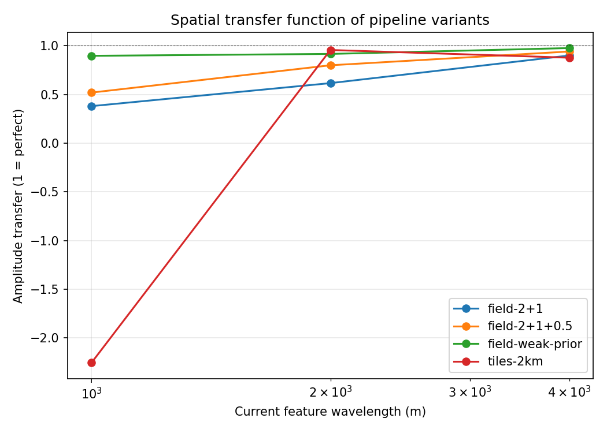
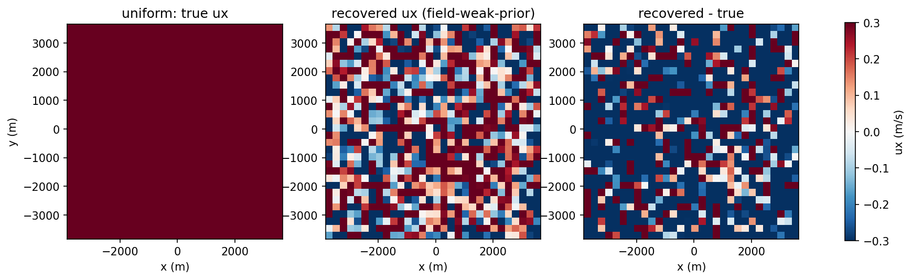
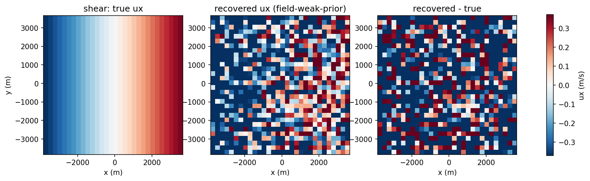
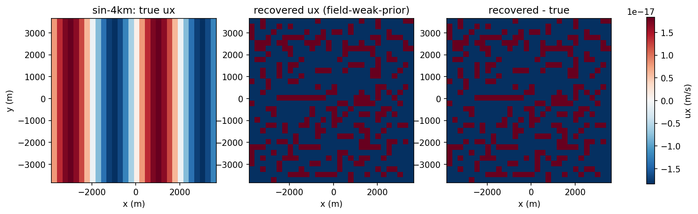
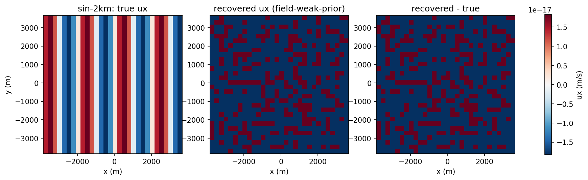
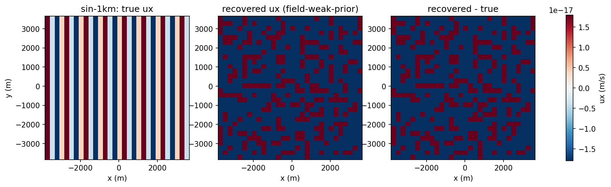
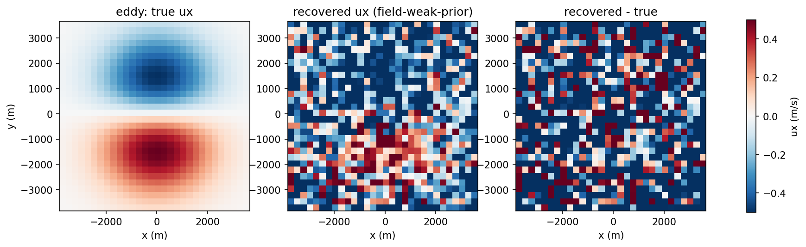
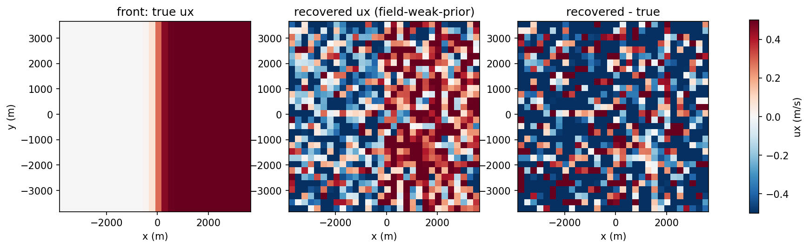

# Spatial Resolution Validation

Empirical resolution measurements of the current-extraction pipeline
variants on synthetic wave cubes with **prescribed, spatially varying
currents** (local plane-wave model, `wamos_tpw.synthetic`). Generated
by `tools/resolution_study.py`:
7.7 km domain, 15 m grid, 64 frames at 1.5 s,
200 wave components (60-600 m wavelengths, directional spread 0.8 rad).

## Variants

- **tiles-2km** — independent 2 km windows at 1 km stride (classical
  WaMoS-style tiling); output at tile centers.
- **field-2+1** — joint regularized inversion of 2 km + 1 km windows
  on a 250 m grid (correlation length 500 m).
- **field-2+1+0.5** — adds 500 m windows.
- **field-weak-prior** — same windows, prior allowing 4x steeper
  gradients (correlation length 250 m, sigma_prior 0.5 m/s): the
  smoothness prior is the resolution knob, trading noise
  suppression for fine-scale response.

## Metrics

- **transfer** — regression of recovered anomaly onto true anomaly
  (1 = feature fully recovered, 0 = invisible).
- **rmse** — over both components at covered output cells (m/s).
- **bias** — mean (ux, uy) error (m/s).
- **calib** — median(|error| / reported 1-sigma); 1 = perfectly
  calibrated errors, >1 = overconfident.

## Results

### uniform — Uniform 0.36 m/s

| variant | transfer | rmse (m/s) | bias ux/uy (m/s) | calib | n |
|---|---|---|---|---|---|
| tiles-2km | nan | 0.090 | -0.009 / -0.080 | 4.2 | 36 |
| field-2+1 | nan | 0.215 | -0.206 / -0.084 | 0.6 | 900 |
| field-2+1+0.5 | nan | 0.231 | -0.219 / -0.110 | 0.5 | 900 |
| field-weak-prior | nan | 0.449 | -0.267 / -0.138 | 0.4 | 900 |

### shear — Linear shear dUx/dx = 1e-4 /s (0.77 m/s across domain)

| variant | transfer | rmse (m/s) | bias ux/uy (m/s) | calib | n |
|---|---|---|---|---|---|
| tiles-2km | 1.06 | 0.088 | +0.010 / -0.083 | 4.3 | 36 |
| field-2+1 | 0.92 | 0.204 | -0.157 / -0.103 | 0.5 | 900 |
| field-2+1+0.5 | 1.01 | 0.223 | -0.200 / -0.112 | 0.5 | 900 |
| field-weak-prior | 1.06 | 0.457 | -0.251 / -0.137 | 0.4 | 900 |

### sin-4km — Sinusoidal shear, 4 km wavelength, 0.3 m/s amplitude

| variant | transfer | rmse (m/s) | bias ux/uy (m/s) | calib | n |
|---|---|---|---|---|---|
| tiles-2km | 0.88 | 0.087 | -0.019 / -0.071 | 4.2 | 36 |
| field-2+1 | 0.90 | 0.219 | -0.192 / -0.106 | 0.6 | 900 |
| field-2+1+0.5 | 0.94 | 0.248 | -0.236 / -0.110 | 0.5 | 900 |
| field-weak-prior | 0.98 | 0.474 | -0.289 / -0.130 | 0.4 | 900 |

### sin-2km — Sinusoidal shear, 2 km wavelength, 0.3 m/s amplitude

| variant | transfer | rmse (m/s) | bias ux/uy (m/s) | calib | n |
|---|---|---|---|---|---|
| tiles-2km | 0.96 | 0.089 | -0.020 / -0.073 | 4.2 | 36 |
| field-2+1 | 0.62 | 0.221 | -0.185 / -0.099 | 0.6 | 900 |
| field-2+1+0.5 | 0.80 | 0.253 | -0.235 / -0.112 | 0.5 | 900 |
| field-weak-prior | 0.92 | 0.468 | -0.284 / -0.132 | 0.5 | 900 |

### sin-1km — Sinusoidal shear, 1 km wavelength, 0.3 m/s amplitude

| variant | transfer | rmse (m/s) | bias ux/uy (m/s) | calib | n |
|---|---|---|---|---|---|
| tiles-2km | -2.26 | 0.119 | -0.032 / +0.120 | 5.7 | 36 |
| field-2+1 | 0.38 | 0.251 | -0.190 / -0.111 | 0.6 | 900 |
| field-2+1+0.5 | 0.52 | 0.270 | -0.230 / -0.123 | 0.6 | 900 |
| field-weak-prior | 0.90 | 0.491 | -0.279 / -0.149 | 0.5 | 900 |

### eddy — Gaussian eddy, 0.5 m/s peak, 1.5 km radius

| variant | transfer | rmse (m/s) | bias ux/uy (m/s) | calib | n |
|---|---|---|---|---|---|
| tiles-2km | 0.96 | 0.104 | -0.024 / -0.076 | 5.2 | 36 |
| field-2+1 | 0.92 | 0.207 | -0.182 / -0.096 | 0.6 | 900 |
| field-2+1+0.5 | 0.99 | 0.256 | -0.241 / -0.112 | 0.5 | 900 |
| field-weak-prior | 1.00 | 0.494 | -0.292 / -0.139 | 0.5 | 900 |

### front — Current front, 0.5 m/s step over 500 m

| variant | transfer | rmse (m/s) | bias ux/uy (m/s) | calib | n |
|---|---|---|---|---|---|
| tiles-2km | 1.03 | 0.094 | -0.002 / -0.095 | 4.0 | 36 |
| field-2+1 | 0.95 | 0.217 | -0.186 / -0.108 | 0.5 | 900 |
| field-2+1+0.5 | 1.03 | 0.234 | -0.207 / -0.123 | 0.5 | 900 |
| field-weak-prior | 1.06 | 0.474 | -0.261 / -0.150 | 0.5 | 900 |

## Figures

## Caveats

- The synthetic model is the local plane-wave approximation: it
  measures the estimator + inversion response, not wave-current
  interaction physics, radar imaging nonlinearity, or shadowing.
- A wave group traverses c_g x T (~0.3-0.8 km here) during a block,
  which the frozen model does not include; real-data resolution at
  short feature scales will be somewhat poorer.
- `calib` > 1 means the reported errors are optimistic by that
  factor; use it to scale error-based thresholds on real data.
